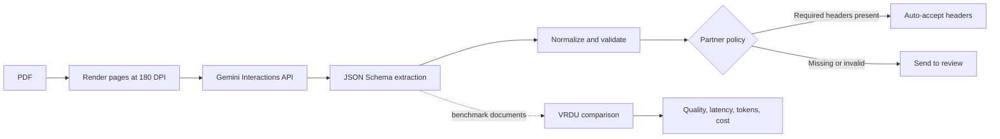

# Gemini Ad Order Review

This is a working document-extraction and review-gating prototype for media-buy orders, contracts, invoices, credit memos, and request sheets. Locally it sends high-resolution page images to Gemini; the Vercel deployment sends the original PDF as an inline document. Both paths validate the structured response in deterministic code and decide whether the document has enough information to bypass header review.

The app also includes an evaluation harness built around the VRDU Ad-buy Forms dataset. Every model run can be compared with gold labels and reported with quality, latency, token, and cost metrics.

[Read the four-slide partner engineering briefing](docs/partner-engineering-briefing.pdf).

## Why the review gate exists

JSON Schema keeps a response parseable. It does not catch a plausible value in the wrong business field. An invoice can contain an Invoice #, an Order #, and a Net Total at the same time; choosing the wrong one still produces valid JSON.

The prototype separates four jobs:

1. Gemini reads the document and returns source-faithful strings or explicit `null` values.
2. Deterministic code normalizes known formatting artifacts and checks dates, money, required fields, and row completeness.
3. A partner policy decides whether headers can bypass review. Line items remain in review in this version.
4. The evaluator compares the same output with VRDU gold labels. Evaluation never changes the partner route.



## Partner field contract

The target record is an ad-buy order, not a general invoice ledger.

- `contract_num`: use Contract #, otherwise Order #. Invoice # does not substitute.
- `gross_amount`: use an explicit Gross Amount, Contract Amount, Grand Total, or credit amount. Net Total and Invoice Total do not substitute.
- `property`: use the legal station or entity name next to the station address.
- `tv_address`: return only the postal address.

The address field passes through a versioned normalizer that removes labeled contact suffixes such as `Main:`, `Billing:`, `Phone:`, and `Fax:`. Dates, money parsing, routing, and scoring stay outside the model. The app does not use model-reported confidence.

## Run it locally

Requirements:

- Node.js 20 or newer
- a Gemini API key created in Google AI Studio
- Poppler to reproduce the saved raster benchmark (`brew install poppler` on macOS, `apt-get install poppler-utils` on Debian or Ubuntu)

```bash
npm install
cp .env.example .env.local
```

Set `GEMINI_API_KEY` in `.env.local`, then validate the bundled benchmark pack:

```bash
npm run data:validate
```

If Poppler is unavailable, add `GEMINI_PDF_INPUT_MODE=inline` to `.env.local`. The app will send the original PDF to Gemini and use the browser's PDF viewer, matching the hosted input path. This is useful for running the demo, but it does not reproduce the saved benchmark.

Start the app:

```bash
npm run dev
```

Open [http://localhost:3000](http://localhost:3000).

The API key stays on the server. Gemini Interactions requests explicitly set `store:false`.

## Demo flow

The three featured documents each answer a different question:

- **Complete order:** can a clean document bypass header review?
- **Invoice plus order IDs:** does the field contract choose Order # and leave gross amount null instead of substituting Invoice # or Net Total?
- **Ten-page order:** does the pipeline remain inspectable when the document is long and the available row labels are unreliable?

The full document list adds rotated pages, dense tables, negative and zero amounts, an out-of-scope form, and OCR noise.

## Evaluation

### Local and hosted input paths

The saved benchmark was produced locally with Poppler. Each PDF page was rendered as a JPEG at 180 DPI and sent to Gemini with `resolution: high`. This is the input path behind every headline quality, latency, token, and cost number below.

Without Poppler, set `GEMINI_PDF_INPUT_MODE=inline`. Vercel selects this mode automatically because it does not provide the Poppler binaries used by the local renderer. In both cases, reruns send the original PDF through the Interactions API as an inline document at API-default resolution. The browser previews the original PDF directly instead of requesting 150 DPI page images from the server.

| | With Poppler | Without Poppler / Vercel |
| --- | --- | --- |
| Model input | 180 DPI JPEG pages | Inline PDF document |
| Media resolution | Explicit `high` | API default |
| Preview | Poppler-rendered 150 DPI image | Browser PDF viewer |
| Upload limit | 50 MB, up to 20 rendered pages | 50 MB locally; 4 MB on Vercel |
| Benchmark status | Source of the saved headline benchmark | One controlled 12-document paired run; not the headline |

Does this change the benchmark? Yes. Native PDFs and rasterized pages can produce different fields, token counts, latency, and cost. The saved dashboard is still the 180 DPI run; it is not a measurement of inline-PDF reruns. The model, JSON schema, thinking level, `store=false`, normalization, validation, and partner review policy are otherwise unchanged.

A separate one-pass comparison held the prompt hash, schema hash, model, thinking level, storage setting, normalization, and document order constant while changing only the input mode and its resolution:

| Metric | 180 DPI pages | Inline PDF |
| --- | ---: | ---: |
| Schema validity | 100% | 100% |
| Header-field pass | 86.4% | 86.4% |
| Auto-accepted key fields correct | 100% | 100% |
| Documents auto-accepted | 8 / 12 | 9 / 12 |
| Exact-row F1 | 58.5% | 29.2% |
| Input tokens | 40,124 | 21,632 |
| Median latency | 4.54 s | 4.20 s |
| Total estimated cost | $0.2035 | $0.1793 |

The row-F1 gap came entirely from the 31-row dense-table document: inline PDF copied the overall flight dates into every row, contrary to the field contract, while the raster run left those row cells null. This shows that the modes are not interchangeable. Inline PDF also used fewer tokens and cost less in this pass. One run is not enough to rank the modes, and the paired raster result does not replace the saved 29.1% row-F1 snapshot. Repeated runs or a larger co-labeled set are required before changing the primary path. The aggregate evidence is in [outputs/input-mode-comparison-public.json](outputs/input-mode-comparison-public.json).

Run the saved 12-document harness with either model:

```bash
npm run eval -- gemini-3.5-flash
npm run eval -- gemini-3.1-flash-lite
```

Run a controlled Poppler-versus-inline-PDF comparison with the same prompt and model settings:

```bash
npm run eval:inputs -- gemini-3.5-flash
```

Recompute validation and comparison after deterministic code changes without paying for another model run:

```bash
npm run eval:rescore -- gemini-3.5-flash gemini-3.1-flash-lite
```

The current Gemini 3.5 Flash run produced:

| Metric | Result |
| --- | ---: |
| Schema-valid responses | 100% |
| Documents bypassing header review | 9 / 12 |
| Accepted documents correct on advertiser, order ID, and gross | 100% |
| Scored header-field pass rate | 88.3% |
| Exact line-item row F1 | 29.1% on 107 rows |
| Aligned line-item field accuracy | 79.2% |
| Median latency | 3.7 s |
| Total measured inference cost | $0.2075 |

Exact-row F1 is deliberately strict. A line item receives credit only when channel, description, both dates, and amount all match one gold row. The aligned-field metric shows partial correctness when a row misses exact credit because one field differs.

The 12-document set is too small to set a production threshold. One result moves a reported rate by 8.3 percentage points. A partner pilot should use 100 to 200 stratified, jointly reviewed documents before choosing an operating threshold.

## Dataset

The repository contains the fixed 12-document VRDU demo subset and its evaluation labels so the hosted workflow can rerun the same documents shown in the saved benchmark. The archived upstream repository does not declare redistribution terms; confirm the intended use before republishing the subset elsewhere. The pack can also be rebuilt from an upstream checkout with `scripts/prepare_vrdu_subset.py` using:

- `config/vrdu-selection.json` for document selection;
- `config/vrdu-adjudications.json` for source-verified corrections and score exclusions.

Five disputed header labels are excluded from headline metrics. A source audit also excludes 64 corrupted row labels from exact-row scoring, leaving 107 of 171 rows in the aggregate.

## Build notes

I started the UI in Google AI Studio Build. The builder returned `RpcError: The caller does not have permission` after a paid key was selected and across several model choices. I moved the app to local Next.js so the integration work could continue while keeping the Gemini request path, schema, and settings explicit.

The other API snag was PDF resolution. Interactions rejected resolution controls on PDF document items, while image items accepted them. The local app therefore renders pages and sends high-resolution image inputs. The Vercel deployment cannot use that Poppler path, so its live reruns use the clearly labeled inline-PDF fallback described above. [FRICTION_LOG.md](FRICTION_LOG.md) records the evidence, partner impact, workaround, and product request for each issue.

## Project map

```text
app/                         Next.js UI and API routes
lib/                         Gemini client, PDF rendering, data loading
shared/                      schema, normalization, validation, scoring
scripts/                     benchmark, rescoring, and dataset tools
schemas/                     JSON Schema used for structured output
prompts/                     extraction prompt and AI Studio build prompts
config/                      fixed selection and adjudication decisions
slides/                      four-slide partner engineering briefing
outputs/EVALUATION_SUMMARY.md aggregate evaluation evidence
```

## Verification

```bash
npm run data:validate
npm run typecheck
npm test
npm run build
```
